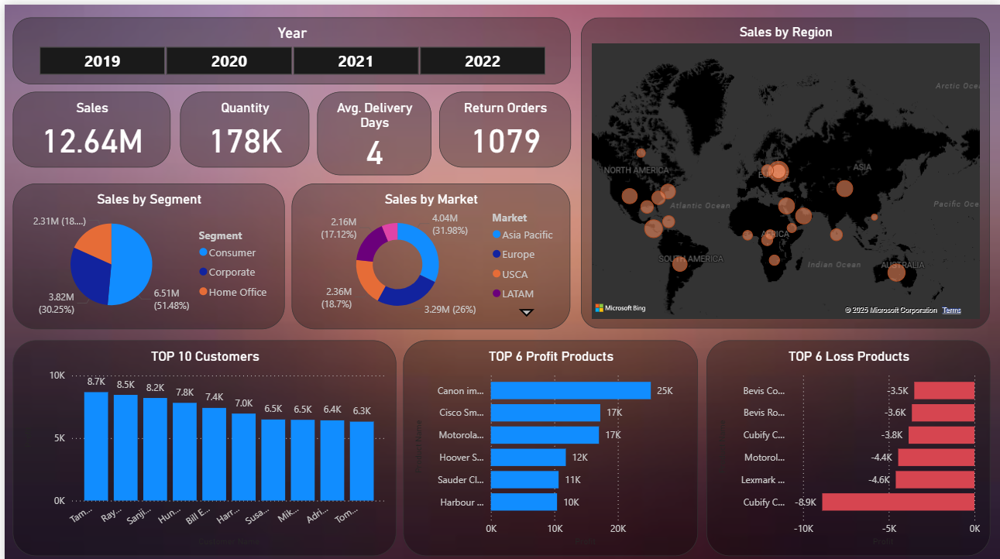

# 📊 Global Sales Dashboard Project

## 📌 Project Overview

This project presents a detailed interactive **Sales Dashboard** built using **Power BI**, aimed at analyzing and monitoring global sales performance. It provides insights into key business metrics such as total sales, customer activity, profit/loss products, regional distribution, and more—allowing for data-driven decisions across different segments and markets.

---

## 🧰 Tools & Technologies Used

- **Power BI** for dashboard creation and interactivity  
- **DAX (Data Analysis Expressions)** for calculated measures  
- **Microsoft Bing Maps** for regional visualization  
- **Data Modeling** for relational tables and slicers  
- **CSV/Excel files** as the data source  

---

## 📷 Dashboard Preview

---

## 🔍 Key Insights

- **Total Sales**: $12.64M  
- **Quantity Sold**: 178K  
- **Average Delivery Days**: 4  
- **Return Orders**: 1,079  

### 📊 Segment & Market Analysis

- **Sales by Segment**:
  - Consumer: 51.48%
  - Corporate: 30.25%
  - Home Office: 18.2%

- **Sales by Market**:
  - Asia Pacific: 31.98%
  - USCA: 26%
  - Europe: 18.7%
  - LATAM: 17.12%

### 🌍 Regional Sales Map

- Visual representation of sales distribution by country and continent.

### 👥 Customer & Product Performance

- **Top 10 Customers** by sales volume.
- **Top 6 Profit Products** (e.g., Canon, Cisco, Motorola).
- **Top 6 Loss Products** (e.g., Cubify, Lexmark, Motorola Router).

---

## 📁 File Details

- **Power BI File**: `Global Sales Dashboard Project.pbix`  
- **Dashboard Preview Image**: `Dashboard.png`

---

## 🚀 How to Use

1. Open the `.pbix` file in Power BI Desktop.
2. Explore the dashboard filters by **year**, **market**, or **segment**.
3. Analyze dynamic KPIs, customer performance, and profit/loss metrics.

---

## 🎯 Outcome

This project demonstrates:

- The ability to design professional, interactive dashboards
- Proficiency in Power BI and data visualization techniques
- Insightful business analysis through real-world data

---

## ⭐ Like this project?

Feel free to star ⭐ the repository and share your feedback!

